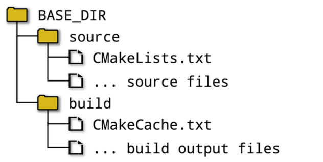

# Fundaments of CMake

- Source directory
  - where the CMakeLists.txt file is located and the project’s
source files and all other files needed for the build are organized under that location
- Binary directory
  - where everything produced by the build is created. It is often also called the build directory.
  - CMake also creates a special file called **CMakeCache.txt** in the
build directory to store various information for reuse on subsequent runs.

**Two Approaches:**

- In-Source builds
- Out-of-Source builds

## In-source Builds

- ***In-source build*** means the source and build directories to be the same.

- **Difficulties:**
  - all the build outputs are intermixed with the source files. making working with version control systems more difficult
  - it can be non-trivial to clear out all build output and start again with a clean source tree.

## Out-of-source Builds

- ***Out-of-source Builds:*** is for the source and build directories to be different.

- **Advantages:**
  - Keeps the sources and the build outputs completely separate from
each other, thus avoiding the intermixing problems experienced with in-source builds.
  - the developer can create multiple build directories for
the same source directory, which allows builds to be set up with different sets of options, such as debug and release versions, etc.

